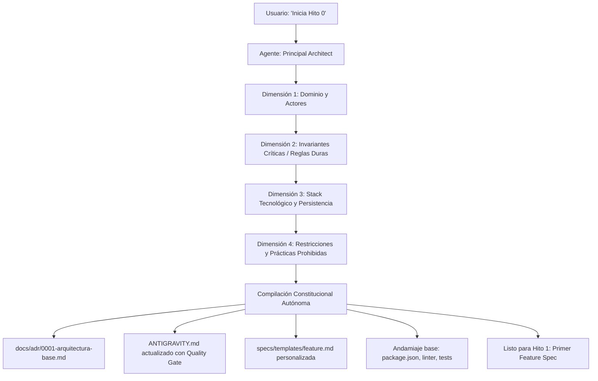

# Blueprint Agnóstico — Hito 0 (Template Repo)

> **Semilla de Gobernanza Agéntica** diseñada para el desarrollo de software de alta precisión con agentes autónomos bajo el arnés **Google Antigravity**. Basado en **Spec-Driven Development (SDD)**, **Architecture Decision Records (ADR)**, **Agentic TDD** y **Quality Gates Deterministas**.

---

## 💡 ¿Por qué existe este Blueprint?

En el desarrollo de software asistido por IA, la premisa fundamental es:
> *Un agente sin especificaciones formales alucina, improvisa dependencias y degrada la arquitectura. El humano diseña contratos, restricciones e invariantes; el agente implementa y valida contra esas restricciones.*

Este repositorio sirve como **plantilla inicial (Template Repo)** para cualquier nuevo proyecto. En lugar de configurar manualmente linters, tipados, carpetas y reglas cada vez, este repositorio empaqueta el **Hito 0 (Bootstrap Constitucional)**: una entrevista técnica interactiva guiada por el agente para compilar automáticamente la arquitectura, las invariantes y los mecanismos de control.

---

## 🚀 Cómo iniciar un nuevo proyecto (Flujo de 3 Pasos)

### 1. Crear nuevo repositorio desde la Plantilla
- En GitHub o GitLab, utiliza este repositorio como **Template** (`Use this template`).
- Asigna el nombre de tu nuevo proyecto y clónalo en tu entorno.

### 2. Abrir en Antigravity IDE
- Abre la carpeta del proyecto en **Antigravity IDE**.

### 3. Ejecutar el Protocolo de Hito 0
En la consola de chat del agente, simplemente escribe:
```text
Inicia Hito 0
```
*(O de forma explícita: `"Ejecuta el protocolo en .antigravity/bootstrap.md"`)*.

---

## 🎙️ ¿Qué sucede durante el Hito 0?

El agente asumirá el rol de **Principal Software Architect** y te guiará en una entrevista breve (máximo 2 preguntas por turno en lenguaje claro) cubriendo 4 dimensiones:



### Artefactos Generados al Finalizar:
| Artefacto | Rol y Propósito |
| :--- | :--- |
| [`docs/adr/0001-arquitectura-base.md`](file://docs/adr/0001-arquitectura-base.md) | Registra el stack tecnológico y las decisiones arquitectónicas como memoria inmutable. |
| [`ANTIGRAVITY.md`](file://ANTIGRAVITY.md) | Fija las fronteras del proyecto, prohíbe tocar archivos fuera de módulo y define comandos de prueba. |
| [`specs/templates/feature.md`](file://specs/templates/feature.md) | Plantilla SDD adaptada con los actores, vocabulario y entidades de tu negocio. |
| **Andamiaje de Configuración** | Instala librerías y configura `package.json`, `tsconfig.json` y linter con suite de tests funcional. |

---

## 📁 Estructura del Repositorio

```text
├── .antigravity/
│   └── bootstrap.md            # Motor del Hito 0: Protocolo de entrevista constituyente
├── docs/
│   └── adr/
│       ├── .gitkeep
│       └── 0000-template.md    # Plantilla estándar para futuros ADRs
├── specs/
│   ├── .gitkeep
│   └── templates/
│       ├── .gitkeep
│       └── feature.template.md # Plantilla base de Spec-Driven Development (SDD)
├── scripts/
│   ├── .gitkeep
│   └── verify.sh               # Script de Quality Gate determinista (código 0 o 1)
├── .gitignore                  # Exclusiones estándar para desarrollo limpio
├── ANTIGRAVITY.md              # Reglas maestras de gobernanza leídas por el arnés
└── README.md                   # Este documento
```

---

## 🔄 Flujo de Trabajo en el Día a Día (Hito 1 en adelante)

Una vez completado el Hito 0, tu interacción con el agente se vuelve determinista y sin fricción de sintaxis manual:

1. **Creación del Requerimiento:**
   Copias [`specs/templates/feature.md`](file://specs/templates/feature.md) a `specs/feat-001-<modulo>.md` y completas:
   - Alcance y límites de archivos permitidos/protegidos.
   - Contratos de entrada y salida (Zod Schemas).
   - Invariantes de negocio (lo que el sistema nunca debe permitir).
   - Criterios de aceptación (Definition of Done).

2. **Entrega al Agente:**
   > *"Implementa la especificación en `specs/feat-001-<modulo>.md`"*

3. **Ciclo Agentic TDD:**
   - El agente genera primero las pruebas unitarias que satisfacen los criterios de aceptación (**Fase Roja**).
   - Implementa el código de producción mínimo en los archivos autorizados (**Fase Verde**).
   - Ejecuta `./scripts/verify.sh` en un bucle cerrado de autocorrección hasta que linters, tipos y tests devuelvan **código de salida 0**.

---

## 🛡️ Verificación Determinista (Quality Gate)

Puedes ejecutar la barrera de calidad en cualquier momento con:
```bash
./scripts/verify.sh
```

El script verificará:
1. `typecheck` (Tipado estricto sin `any`).
2. `lint` (Validación de reglas estáticas y formato).
3. `test` (100% de tests unitarios y de integración superados).
