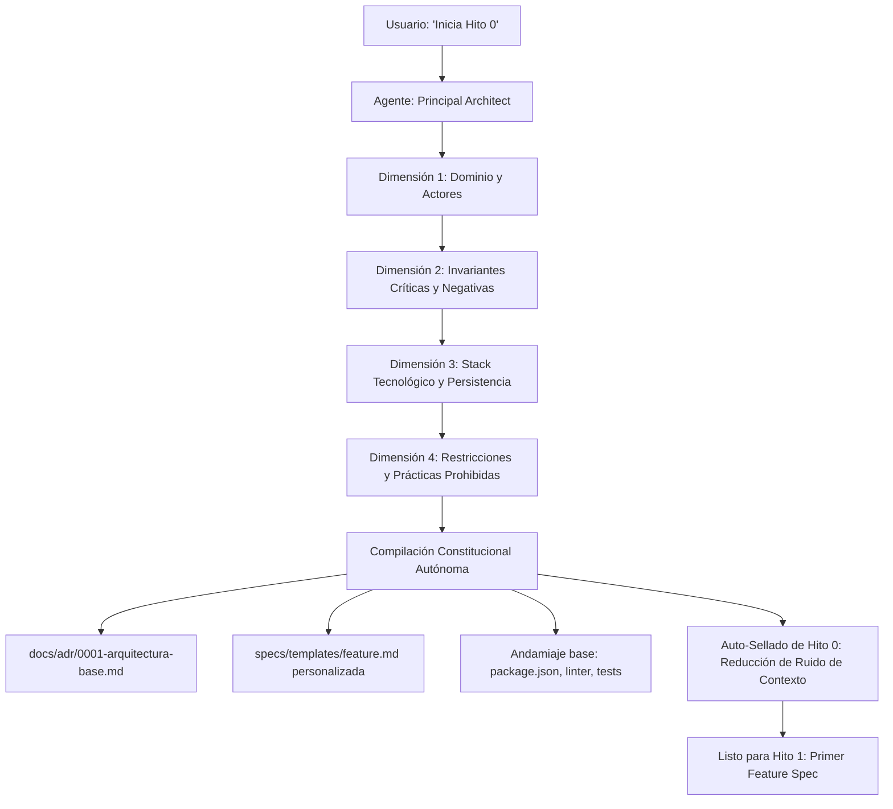

# Blueprint Agnóstico — Hito 0 (Template Repo)

> **Semilla de Gobernanza Agéntica Agnóstica** diseñada para el desarrollo de software de alta fidelidad con agentes autónomos (Google Antigravity, Claude Code, Cursor, Roo Code, etc.). Basado en **Spec-Driven Development (SDD)**, **Architecture Decision Records (ADR)**, **Agentic TDD** y **Quality Gates Deterministas**.

---

## 💡 ¿Por qué existe este Blueprint?

En el desarrollo de software asistido por IA, la premisa fundamental es:
> *Un agente sin especificaciones formales alucina, improvisa dependencias y degrada la arquitectura. El humano diseña contratos, restricciones e invariantes; el agente implementa y valida contra esas restricciones.*

Este repositorio sirve como **plantilla inicial (Template Repo)** para cualquier nuevo proyecto. En lugar de configurar manualmente linters, tipados, carpetas y reglas cada vez, este repositorio empaqueta el **Hito 0 (Bootstrap Constitucional)**: una entrevista técnica interactiva guiada por el agente para compilar automáticamente la arquitectura, las invariantes y los mecanismos de control.

---

## 🚀 Cómo iniciar un nuevo proyecto (Flujo de 3 Pasos)

### 1. Crear nuevo repositorio desde la Plantilla
- En GitHub o GitLab, utiliza este repositorio como **Template** (`Use this template`).
- Asigna el nombre de tu nuevo proyecto y clónalo en tu entorno local.

### 2. Abrir en tu Entorno Agéntico
- Abre la carpeta del proyecto en **Antigravity IDE** (o tu arnés agéntico preferido).

### 3. Ejecutar el Protocolo de Hito 0
En la consola de chat del agente, simplemente escribe:
```text
Inicia Hito 0
```
*(O de forma explícita: `"Ejecuta el protocolo en .agents/bootstrap.md"`)*.

---

## 🎙️ ¿Qué sucede durante el Hito 0?

El agente asumirá el rol de **Principal Software Architect** y te guiará en una entrevista breve (máximo 2 preguntas por turno en lenguaje claro) cubriendo 4 dimensiones:



### 🔒 Protocolo de Auto-Sellado (Self-Sealing Transition)
Para evitar la contaminación del contexto del modelo en futuros desarrollos:
1. Se archiva `.agents/bootstrap.md` para que ningún agente intente reiniciar la entrevista.
2. [`STATE.md`](file://STATE.md) se actualiza de forma autónoma a **Hito 1 (En Desarrollo)**.
3. [`AGENTS.md`](file://AGENTS.md) se limpia, dejando solo las reglas operativas de código de producción.
4. [`README.md`](file://README.md) se transforma en la documentación oficial de tu aplicación.

---

## 📁 Estructura del Repositorio Semilla

```text
├── .agents/
│   └── bootstrap.md            # Motor del Hito 0: Protocolo de entrevista constituyente
├── docs/
│   └── adr/
│       ├── .gitkeep
│       └── 0000-template.md    # Plantilla estándar para futuros ADRs
├── specs/
│   ├── .gitkeep
│   └── templates/
│       ├── .gitkeep
│       └── feature.template.md # Plantilla base de Spec-Driven Development (SDD)
├── src/
│   ├── core/                   # Núcleo compartido (DB, loggers, middlewares)
│   └── modules/                # Dominios verticales cerrados
├── tests/
│   └── modules/                # Pruebas unitarias/integración por módulo
├── scripts/
│   ├── .gitkeep
│   └── verify.sh               # Script de Quality Gate determinista (código 0 o 1)
├── .env.example                # Variables de entorno documentadas (tipadas vía Zod)
├── .gitignore                  # Exclusiones estándar para desarrollo limpio
├── AGENTS.md                   # Reglas maestras de gobernanza universales
├── STATE.md                    # Tablero de control y memoria de estado persistente
└── README.md                   # Este documento
```

---

## 🛡️ Pilares de Excelencia Agéntica

1. **Invariantes Negativas Explícitas:** Las especificaciones definen claramente qué operaciones o estados son *intolerables* (ej. saldo negativo, texto plano, mutaciones no atómicas).
2. **Errores de Dominio Tipados:** Prohibido `throw new Error()`; todo error se tipa y se mapea a códigos HTTP semánticos (400, 404, 409).
3. **Manejo Seguro de Entorno:** Prohibido acceder a `process.env` fuera de `src/core/config.ts`, donde Zod valida las variables en el arranque.
4. **Conventional Commits:** Todo commit de agente sigue el estándar (`feat(modulo): ...`, `test(modulo): ...`, `fix(modulo): ...`).
5. **Quality Gate Determinista:** Ninguna tarea se entrega si `./scripts/verify.sh` no termina con código de salida `0`.

---

## 🔄 Flujo de Trabajo en el Día a Día (Hito 1 en adelante)

1. **Creación del Requerimiento:**
   Copias [`specs/templates/feature.md`](file://specs/templates/feature.md) a `specs/feat-001-<modulo>.md` y completas contratos, invariantes y criterios.
2. **Entrega al Agente:**
   > *"Implementa la especificación en `specs/feat-001-<modulo>.md`"*
3. **Ciclo Agentic TDD:**
   - El agente escribe los tests unitarios primero (**Fase Roja**).
   - Implementa la solución mínima en los archivos autorizados (**Fase Verde**).
   - Ejecuta `./scripts/verify.sh` hasta obtener **código de salida 0**.
   - Registra el avance en [`STATE.md`](file://STATE.md).
